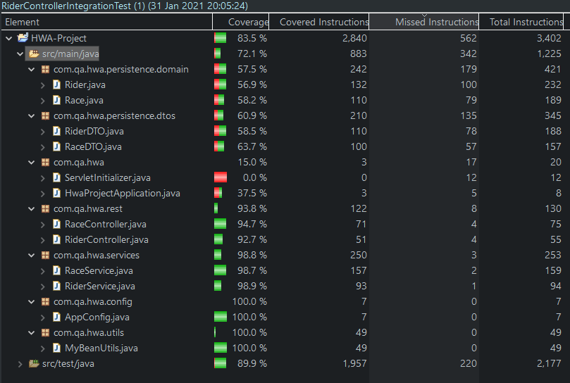

HWA Project
===========

This is a web application for managing bike races. It can be used to create, read, update and delete rider and race records in a persistent SQL database.

# Getting Started

These instructions will get you a copy of the project up and running on your local machine for development and testing purposes. See deployment for notes on how to deploy the project on a live system.

## Prerequisites

### Java
[Java Development Kit (JDK)](https://www.oracle.com/java/technologies/javase-downloads.html) version 14 is required to build the application.

### Maven
[Maven](https://maven.apache.org/download.cgi) is required to build the project and to run tests.

### Spring Tool Suite
[Spring Tool Suite 4](https://spring.io/tools) is required to run the application on local machine for configuration and testing.

## Installation and usage

### Installing

A step by step series of examples that tell you how to get a development env running

1. Download and install Java and Maven. Add environment variables to access them from the command line. On Windows this can be done by opening System Properties, clicking Environment Variables and adding the locations of the bin folders within the Java and Maven installation to the system path.
2. Download and install Spring Tool Suite.
3. Clone the project Git repository onto your local machine, or download it as a .zip from GitHub and extract it.


### Using the application
1. Open the project in Spring Tool Suite and run it locally by right-clicking HWA-Project in the Boot Dashboard and selecting (re)start.
2. Open a web browser and navigate to ```http://localhost:8080/html/index.html```, this will load the application home page.
3. Click riders on the navbar to go to the riders page. Create some riders by entering details in the create riders box and clicking the "Create Rider" button. Check that the output at the bottom of the page displays "Rider created". Then read all riders to verify that their details are correct.
4. Navigate to races and create some races in the same manner.
5. Navigate back to riders and add riders to races using their IDs the "Add rider to race" button.
6. Riders and races can also be updated and deleted using the appropriate box. **Be aware that deleting a race will also delete all riders in that race from the riders database.** This will be fixed in a future update. As a workaround remove all riders from a race before deleting it.

### Running the tests
You can run the tests for the application with ```mvn test```. If you want to run a specific test you can use the ```-Dtest``` flag e.g. to only run the test class RiderControllerIntegrationTest, run ```mvn -Dtest=RiderControllerIntegrationTest test```.

The test coverage for the ```src/main/java``` folder is 72.1%. The coverage report is below.



### Deployment

1. Open a terminal and build the project by entering ```mvn clean package```. This will build the project and run the tests.
2. The result of the build, found in the target folder, is a .war file which can be run on a web server.

## Built With

* [Maven](https://maven.apache.org/) - Dependency Management

## Jira board

[Link to Jira board](https://kieran20novsoftware2.atlassian.net/jira/software/projects/HP/boards/5).

## Authors

* **Kieran Hanahoe** - [khanahoe-qa](https://github.com/khanahoe-qa)

## License

This project is licensed under the MIT license - see the [LICENSE.md](LICENSE.md) file for details 

## Acknowledgments

* Thanks to the QA trainers for teaching me and helping me with the project, particularly Savannah Vaithilingam and Alan Davies.
